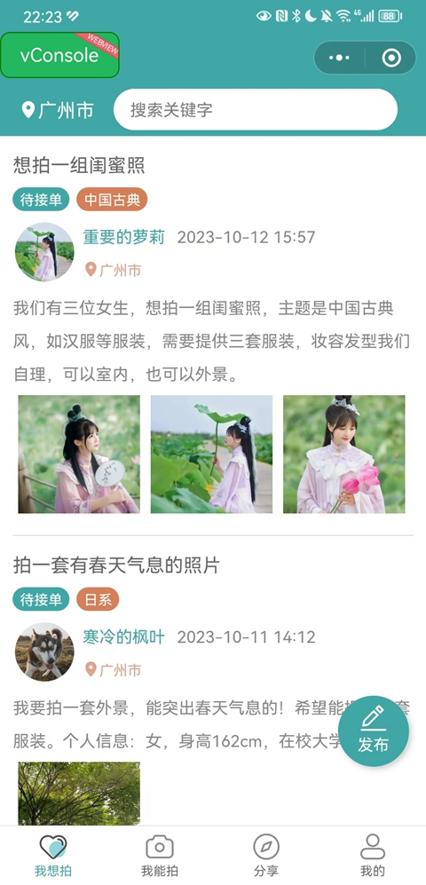

# biyesheji
毕业设计项目展示

# 分享项目

#### 介绍
野生程序猿的分享毕业设计项目：助农小程序、公寓之家、学习小助手、付费自习室、网上商城等项目。获取方式请见Readme详情页面。

#### 获取项目方式
邮箱：157086662@qq.com。需要 **《助农小程序》、公寓平台、自习室** 等项目的同学请联系我。宠物认养、树洞倾诉、校友网项目已开源，请自行clone即可。

#### 部分项目展示：
1. 助农小程序  

2. 摄影约拍小程序  

3. 认养一棵树  

4. 校园学习小助手  

5. 付费自习室小程序

